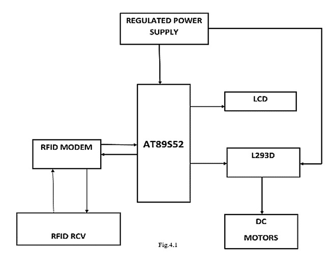

# RFID Based Toll Plaza System

An embedded system project that automates toll collection using RFID technology
and an 8051 microcontroller.

---

##  Overview

When a vehicle's RFID tag is scanned, the system validates it against registered
tags, deducts ₹10 from the linked balance, and displays the updated balance on a
16x2 LCD. Invalid tags trigger an "Access Denied" message with audio feedback.

---

##  Components Used

- 8051 Microcontroller – Main processing unit
- EM-18 RFID Reader – 125 kHz passive tag reader
- RFID Tags – Unique ID cards per vehicle
- 16x2 LCD Display – Shows balance and status
- USBasp Programmer – For flashing the 8051
- Buzzer – Audio feedback
- LEDs (Red & Green) – Visual access indication
- Jumper Wires – Connections

---

##  Features

- Contactless RFID-based vehicle identification
- Automatic toll deduction (₹10 per pass)
- Real-time balance display on LCD
- Valid/Invalid tag detection
- Visual feedback via Red and Green LEDs
- Audio feedback via buzzer
- Interrupt-driven UART serial communication at 9600 baud

---

##  Pin Configuration

**EM-18 to 8051:**
- VCC → +5V
- GND → GND
- TX → RXD (P3.0)
- RX → Not used

**LCD to 8051:**
- Data lines (D0–D7) → P0
- RS → P2.0
- RW → P2.1
- EN → P2.2

**Buzzer → P2.3**

---

##  Block Diagram

---

##  Working

1. System initializes and displays "Scan Tag..." on LCD
2. Vehicle RFID tag is brought near EM-18 reader
3. Tag ID is received via UART interrupt
4. Tag is compared against stored valid IDs
5. **If valid:** ₹10 deducted, updated balance shown, buzzer beeps, green LED lights
6. **If invalid:** "INVALID TAG!" displayed, red LED lights
7. System resets and waits for next scan

---

##  Software

- Language: Embedded C
- Compiler: Keil µVision (8051)
- Programmer: USBasp with AVRDUDE

---

##  Repository Structure
├── main.c           # Main source code
├── Ckt diagram.png 
├── block_diagram.png
├── README.md
└── LICENSE

---

##  Future Improvements

- EEPROM integration for persistent balance storage
- Support for multiple tag IDs via external memory
- Integer-based balance (paise) for accurate computation
- Timer-based non-blocking buzzer control
- Admin override tag for emergency/VIP vehicles
- Transaction logging with timestamps

---

##  Authors

Name - Register No. - Email
S. Aishwarya - 23BEC1047 - aishwarya.s2023@vitstudent.ac.in
Swetha C.A. - 23BEC1435 - swetha.ca2023@vitstudent.ac.in 

---

##  Course

**BECE204L – Microprocessors and Microcontrollers**  
School of Electronics Engineering (SENSE), VIT Chennai  
April 2025

---

##  License

This project is licensed under the MIT License. See [LICENSE](LICENSE) for details.
